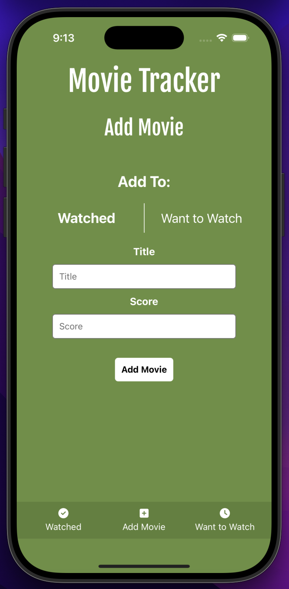
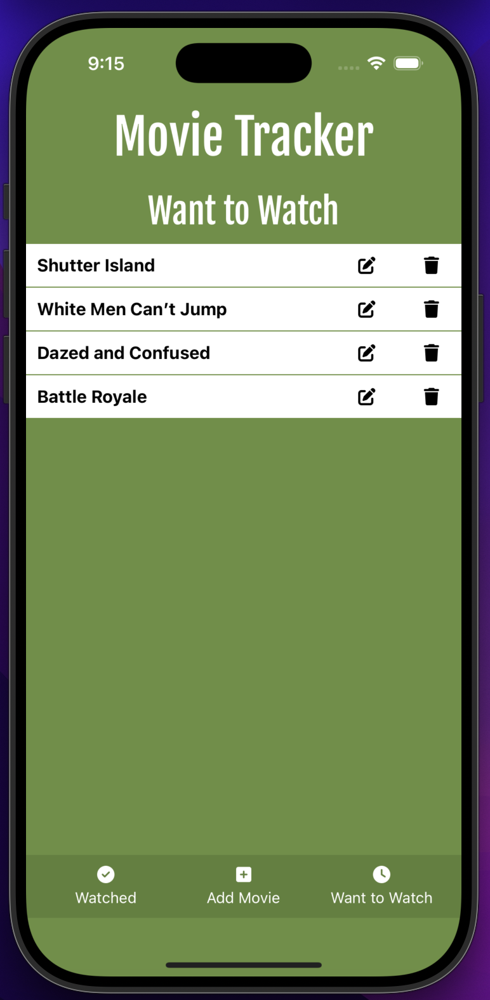

This is a new [**React Native**](https://reactnative.dev) project, bootstrapped using [`@react-native-community/cli`](https://github.com/react-native-community/cli).

# MovieTracker

This is a ReactNative application for easily tracking the movies you watch and want to watch. It is a simple, 3-tab iOS application that includes the following views:
- **Watched View**: A screen listing the names of all the movies you *have watched* along with their scores, an edit button, and a delete button.
- **Add Movie View**: A screen that easily allows you to add movies to your *Watched* movies list or your *Want to Watch* movies list.
- **Want to Watch View**: A screen listing the names of all the movies you *want to watch* along with an edit button, and a delete button.

<div style="display: flex; justify-content: space-around;">
  
  
  
</div>

## Getting Started

>**Note**: Make sure you have completed the [React Native - Environment Setup](https://reactnative.dev/docs/environment-setup) instructions till "Creating a new application" step, before proceeding.

## Installation

1. Clone the git repository
```bash
git clone https://github.com/andyboulle/MovieTracker.git
cd MovieTracker
```

2. Install necessary npm packages
```bash
npm install
```

## Setup

### Step 1: Start the Metro Server

First, you will need to start **Metro**, the JavaScript _bundler_ that ships _with_ React Native.

To start Metro, run the following command from the _root_ of your React Native project:

```bash
# using npm
npm start

# OR using Yarn
yarn start
```

## Step 2: Start your Application

Let Metro Bundler run in its _own_ terminal. Open a _new_ terminal from the _root_ of your React Native project. Run the following command to start your _Android_ or _iOS_ app:

### For Android

*NOTE:* This application has only been tested using iOS. Errors could arise while trying to use the Android version of this application.

```bash
# using npm
npm run android

# OR using Yarn
yarn android
```

### For iOS

```bash
# using npm
npm run ios

# OR using Yarn
yarn ios
```

If everything is set up _correctly_, you should see your new app running in your _Android Emulator_ or _iOS Simulator_ shortly provided you have set up your emulator/simulator correctly.

This is one way to run your app — you can also run it directly from within Android Studio and Xcode respectively.

## Features

- Track movies you have watched
- Add to a list of movies you want to watch
- Edit and delete movies from your lists
- Persistent storage

## Contributing

Contributions are welcome! Please open an issue or submit a pull request.
